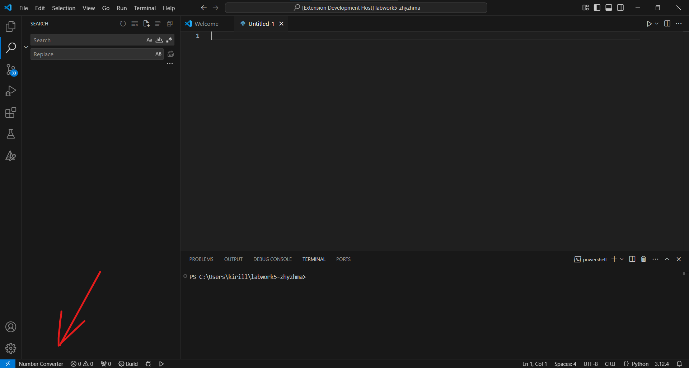
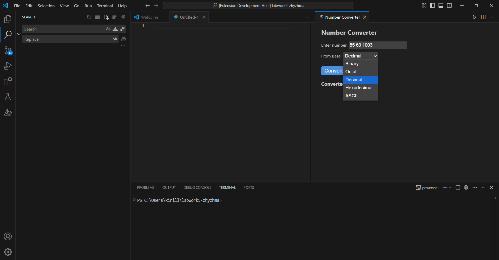
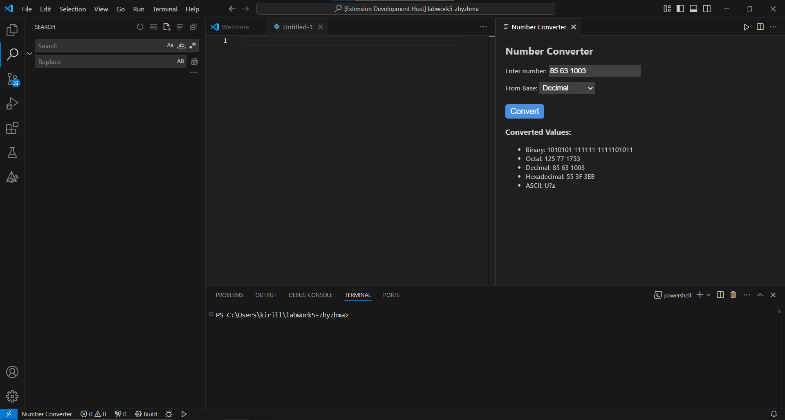
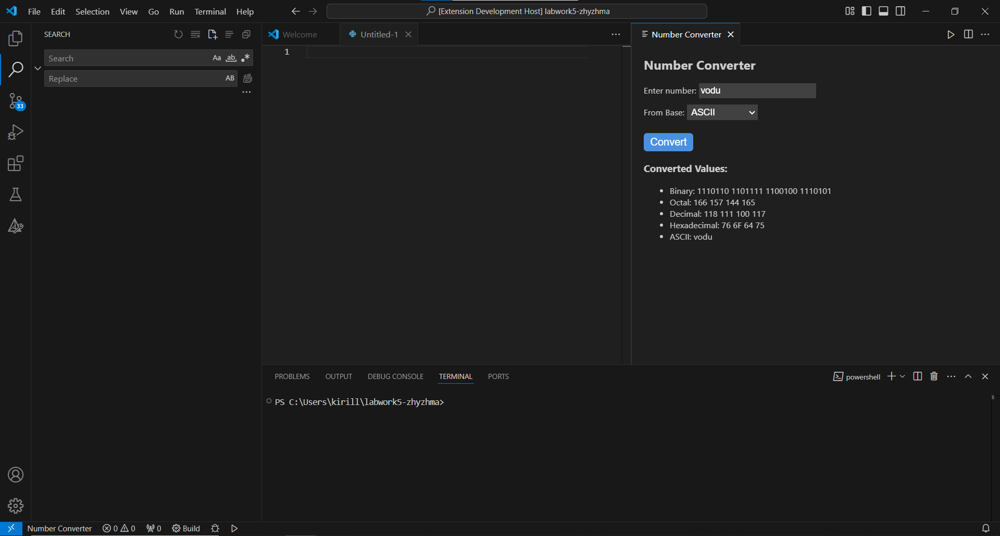

# number-converter 

This is VS Code Plug-in, which converts numbers into different number systems

*Made by Kirill Dorovskikh, ITMO IS M3104*

## Installation

- Download vscode-number-converter-0.0.1.vsix
- Open VS Code
- Open "Extentions" Tab
- Click on three dots
- Click on "Install from VSIX..."
- Choose the previous installed file
- Done!

## Usage

To use this extension, press the button on the bottom panel

Then enter numbers you want to convert, separeted by space, and choose the base you want to convert from

Converter will write those numbers in binary, octal, decimal, hexadecimal and ASCII formats

You also can enter a text, and converter will represent it as ASCII symbols in different number systems

